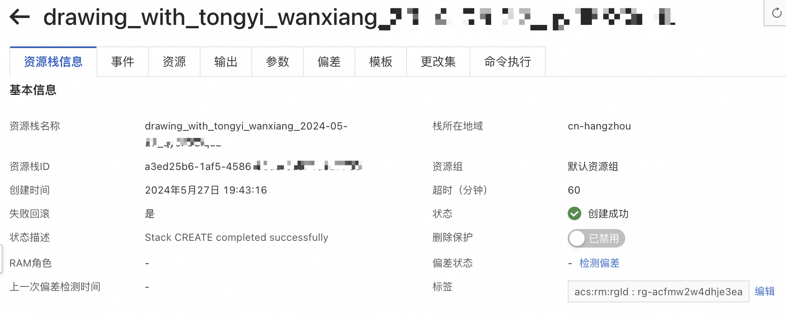
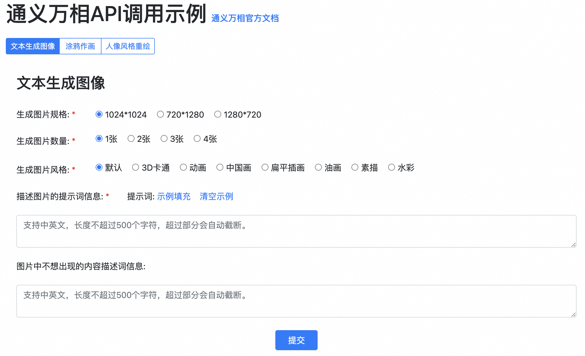

## 方案概览

本解决方案展示了如何利用自研的通义万相AIGC技术在Web服务中实现先进的图像生成。其中包括文本到图像、涂鸦转换、人像风格重塑以及人物写真创建等功能。这些能力可以加快艺术家和设计师的创作流程，提高创意效率。同时，也可以在广告营销、教育和游戏开发等多个领域进行应用，以提升内容的视觉表现和用户体验。通过通义万相，用户可以轻松将文字描述或简单草图转化为高质量图像，实现个性化视觉内容的定制，满足社交媒体、电子商务和电子娱乐产业的需求。这标志着艺术创作、个性化表达和数字内容开发的无限可能性。

## 方案架构

方案提供的默认设置完成部署后在阿里云上搭建的网站运行环境如架构图所示。

### 本方案的技术架构包括以下基础设施和云服务

- 1个专有网络VPC：云服务器ECS创建于此VPC下。
- 1台交换机：云服务器ECS创建于此交换机下。
- 1台云服务器ECS：用于部署示例应用程序。
- 1个对象存储OSS Bucket：存储用户上传的图片，并生成签名的URL提供给大模型进行下载。建议使用和ECS同地域下的OSS Bucket。
- 百炼模型服务：用于示例应用程序调用通义万相的服务。

## 部署准备

开始部署前，请按以下指引完成账号申请、账号充值、服务开通及授权。

### 准备账号

1. 如果您还没有阿里云账号，请访问[阿里云账号注册页面](https://account.aliyun.com/register/qr_register.htm)，根据页面提示完成注册。阿里云账号是您使用云资源的付费实体，因此是部署方案的必要前提。
2. 为阿里云账号充值

   * 为节省成本，本方案默认全部选择使用按量付费资源，使用按量付费资源需要确保账户余额不小于100元。
   * 完成本方案的部署及体验，预计产生费用不超过10元

### 开通百炼服务并获取API-KEY

1. 前往[模型广场](https://bailian.console.aliyun.com/#/model-market)开通模型服务。
2. 获取API Key：为了能够通过API调用大模型，您还需要在[API Key管理界面](https://bailian.console.aliyun.com/?apiKey=1)创建API Key。
   
**说明：请务必妥善保管API Key，避免明文写入代码中造成泄露。**

## 一键部署

1. 单击[一键部署](https://ros.console.aliyun.com/region/stacks/create?templateUrl=https://ros-public-templates.oss-cn-hangzhou.aliyuncs.com/service_template/technical-solution/drawing_with_tongyi_wanxiang_new.yml&hideStepRow=true&hideStackConfig=true&pageTitle=创意加速器：AI绘画创作&disableRollback=false&isSimplified=true&disableNavigation=true&productNavBar=disabled)前往ROS控制台。
2. 选择百炼 API-KEY、ECS实例规格（2核8g）和可用区，以及输入实例密码，配置应用登录信息，建议您手动记录配置的用户名以及密码，下次可直接登录示例应用。具体产生的费用根据您选择的ECS规格而不同，以控制台显示为准。

**注意：一定要保存好配置应用登录信息的用户名和密码，这是登录示例应用的唯一口令。**

开始创建后，等待约5分钟左右，显示创建成功。
如出现以下情况：请单击 **开通链接** 开通OSS服务，即可继续创建。

## 完成及清理

### 方案验证

* 单击资源栈的 **输出** 页签，再单击体验地址对应的URL进行访问。

* 在浏览器中打开体验地址后，在登录页面上输入之前配置的用户名和密码，然后进行登录。

**说明**

如果遗忘用户名可在创建ROS资源栈中的参数DemoUserName找到您的设置信息。

* 现在您即可开始体验通义万向API。

### 清理资源

在本方案中，您创建了1台云服务器ECS实例、1个交换机、1个专有网络VPC、1个对象存储OSS的Bucket。如果您无需继续使用，请尽快删除资源，避免继续产生费用

1. 登录[ROS控制台](https://ros.console.aliyun.com/overview)。
2. 在左侧导航栏，选择 **资源栈** 。
3. 在 **资源栈** 页面的顶部选择部署的资源栈所在地域，找到资源栈，然后在其右侧 **操作** 列，单击 **删除** 。
4. 在 **删除资源栈** 对话框，选择 **删除方式** 为 **释放资源** ，然后单击 **确定** ，根据提示完成资源释放。
5. 删除百炼 **API-KEY** ：
   在[API-KEY管理](https://bailian.console.aliyun.com/?apiKey=1)页面，找到目标API-KEY，单击右侧 **操作** 列下的 **删除** ，根据页面提示进行删除。
